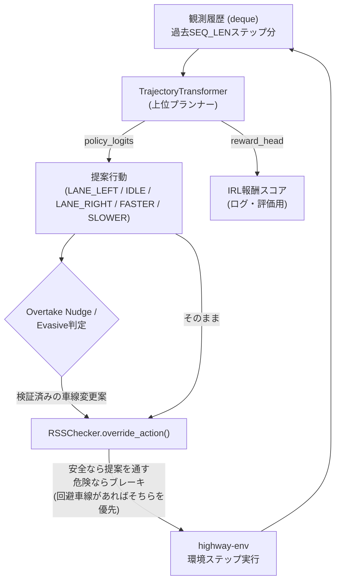

# highway-env-IRL-RSS
highway-envの環境下における、逆強化学習とRSS数理モデル(縦方向の最小安全距離)を組み合わせた自動運転AIの実験プロジェクトです。安全性と走行効率の両立を実装しています。

# IRL + Transformer + RSS による自動運転エージェント

highway-env上で、**逆強化学習(IRL) × TrajectoryTransformer × Responsibility-Sensitive Safety(RSS)** を組み合わせた自動運転エージェントを開発したプロジェクトです。

単に「動くものを作る」だけでなく、開発の過程で複数回発生した**モデルの偏り・環境設計の不整合・安全ロジックの設計不備**を、ログ・動画フレーム・ハッシュ検証といった実証的な手段で一つずつ切り分け、自動車業界の機能安全の考え方（RSS）を壊さずに解決していった記録でもあります。README後半に、その一連のトラブルシューティング過程をケーススタディとしてまとめています。

## デモ

`drive_visualization.mp4` に、Tesla FSD風のUIを重ねた走行シーンの録画を同梱しています。危険域で前走車を検知し、RSSの安全判定を維持したまま車線変更で追い越し、その後72km/hで安定巡航するまでの流れが確認できます。

---

## 目次

- [アーキテクチャ](#アーキテクチャ)
- [開発過程：7つのケーススタディ](#開発過程7つのケーススタディ)
- [結果](#結果)
- [プロジェクト構成](#プロジェクト構成)
- [セットアップと実行方法](#セットアップと実行方法)
- [主要な設定パラメータ](#主要な設定パラメータ)
- [安全設計の考え方](#安全設計の考え方)
- [再現性について](#再現性について)
- [今後の課題](#今後の課題)
- [参考](#参考)

---

## アーキテクチャ



- **TrajectoryTransformer**：過去の観測系列から次の行動を提案する上位プランナー。Behavior Cloning（policy_head）とIRL（reward_head）を同時に学習する。
- **RSSChecker**：Mobileyeが提唱したRSSモデルの縦方向最小安全距離を実装した、ルールベースの安全性の最終防衛ライン。学習済み方策がどんな行動を提案しても、危険と判定すれば介入する。
- **Overtake Nudge / Evasive判定**：RSSと対になる「後押し」ロジック。ブレーキだけでは安全を確保できない場面や、モデルが消極的すぎる場面で、検証済みの車線変更案をRSSに提示する。

---

## 開発過程：7つのケーススタディ

最終的な挙動に至るまでに踏んだ、実際のデバッグ過程です。それぞれ「何が起きたか」→「どう特定したか」→「どう直したか」の順でまとめています。

### 1. クラス不均衡：模倣学習データの4%問題

**症状**：可視化動画を見ると、AIが同じ車線でIDLE/SLOWERを選び続け、遅い前走車を一切追い越さない。

**原因特定**：エキスパートデータ（IDM+MOBIL）を集計すると、LANE_LEFT/LANE_RIGHTのサンプルが全体の**約4%**しかなく、模倣学習が多数派クラス（IDLE）に強く引っ張られていた。

**対策**：
- `collect_demo.py`に、reset直後および一定間隔ごとに前走車を確率的に減速させる`inject_slow_lead_vehicles()`を追加し、「追い越すべき」お手本シーンの絶対数を増やした
- 収集後の比率が目標(18%)に届かなければ追加エピソードを収集し、それでも届かなければ微小ノイズ付きオーバーサンプリングで補正
- 結果、車線変更比率を **4% → 18%** まで引き上げた

### 2. 過剰補正：Class Weights × WeightedRandomSamplerの二重がけ

**症状**：①の対策後、`train_irl.py`でClass WeightsとWeightedRandomSamplerを両方有効化して再学習したところ、検証データではIDLEのRecallが50.3%まで低下。実走行では**IDLEを一度も選ばず**、車線変更を連発して前走車に衝突した。

**原因特定**：クラス不均衡の是正が「Loss側の重み付け」と「サンプリング側の頻度操作」の**二重がけ**になっており、少数派クラス（車線変更）への補正が効きすぎていた。

**対策**：
- `WeightedRandomSampler`を無効化し、Loss側の重み（`CLASS_WEIGHT_LOSS_SCALE`）のみ0.6→0.35に緩和
- モデルの採用基準を`macro_recall`（少数派を当てれば上がる指標）から`macro_f1`（外しすぎにもペナルティが働く指標）に変更
- クラスごとのPrecision/Recall/F1と混同行列を学習後に出力するようにし、以後は数値で偏りを確認できるようにした

### 3. Train/Evalの環境設定不一致

**症状**：②を解消しても、`main.py`実行時の行動分布ではLANE_LEFT/RIGHTが0%のまま。オフラインの検証データでは高いRecall（86〜95%）が出ているにもかかわらず。

**原因特定**：`collect_demo.py`にだけ`lanes_count`/`vehicles_density`を追加しており、`main.py`/`visualize.py`側の環境設定と一致していなかった。学習は「密な交通」、評価は「疎な交通（デフォルト値）」という典型的なtrain/test分布のズレ。

**対策**：3スクリプトすべての`env.unwrapped.configure()`を統一。

### 4. 物理的な限界：ブレーキが効かない

**症状**：③の修正後も、あるシーンでAIが前走車に追突。動画のテレメトリを1フレームずつ確認すると、`Speed`と`Target`が**72km/h(=20m/s)に張り付いたまま一度も下がっていない**のに、車間だけが縮み続けていた。

**原因特定**：highway-envの`DiscreteMetaAction`は既定で選べる巡航速度が`[20, 25, 30] m/s`の3段階のみ。前走車がそれより遅い場合、SLOWERをどれだけ選んでも物理的に20m/s未満には減速できない。RSSが正しく「危険」と判定し続けているのに、ブレーキという手段そのものが効かない状態だった。

**対策**：`target_speeds`を`[10, 15, 20, 25, 30] m/s`に拡張し、ブレーキが実際に意味を持つ速度域を確保。

### 5. RSSの「ブレーキ一択」という設計の穴

**症状**：④と並行して、RSSが危険と判定すると**モデルや後述のNudgeが提案した車線変更を問答無用でブレーキに上書き**してしまい、回避行動が一切通らないことが判明。

**設計判断**：ここが本プロジェクトで最も重視したポイントです。「危険域でRSSの判定をスキップして強行突破させる」のではなく、**RSS自身の判断材料を増やす**方向で解決しました。

```python
if lane_change_action is not None and proposed_action == lane_change_action:
    return lane_change_action  # 検証済みの回避車線があればそちらを許可
# それ以外は従来通り必ずブレーキへ強制介入
```

`is_adjacent_lane_clear()`で隣接車線の安全を検証した上でのみ、RSSはブレーキではなく回避を選べるようになる。**危険と判定する権限はRSSに残したまま、選択肢を「ブレーキだけ」から「検証済みの回避を含む」に広げた**、という設計です。これはMobileyeのRSSが本来持つ「事故責任を回避できる行動を選ぶ」という思想にも合致します。

### 6. ハンチング（うねうね運転）バグ、2連発

**症状**：⑤の実装直後、車線変更の提案が数ステップおきに連発され、車体が車線の中央に定まらず「行ったり来たり」する危険な挙動が発生。

- **1つ目の原因**：車線変更の「ロック」を、highway-envの`vehicle.lane_index`（現在位置に一番近い車線を毎ステップ再計算した値）が変わった瞬間に解除していた。車体が車線をまたぎ切る前にロックが解け、再提案→再解除のループになっていた。→ 到達判定をやめ、固定ステップ数（`LANE_CHANGE_HOLD_STEPS`）で保持する方式に変更。
- **2つ目の原因**：Nudgeの発火条件`danger_signal`に`or proposed_action == ACTION_SLOWER`が含まれており、RSSが「もう安全」と判定した後もモデルがSLOWERを提案し続ける限り、危険信号のカウントがリセットされなかった。`[DEBUG]`ログを仕込んで検証した結果、**RSSが安全と言っているのにNudgeだけが発火し続けている**ことを確認し特定。→ 判定を`not was_safe`のみに単純化。

### 7. 再現性の実証

コードを直すだけでなく、**「本当に再現するのか」を実測で確認**しました。同一seedで`main.py`を2回連続実行し、各エピソードの行動列をMD5ハッシュ化して比較。全エピソードで完全一致することを確認済みです。あわせて、開発環境にグローバルインストールされていた無関係な150個近いパッケージから、実際にimportされている6つの依存関係だけを`requirements.txt`として切り出しました。

---

## 結果

| 指標 | 対策前 | 対策後 |
|---|---|---|
| デモデータの車線変更比率 | 約4% | 約18% |
| 検証データでのLANE_LEFT Recall/Precision | - | 86.5% / 94.1% |
| 検証データでのLANE_RIGHT Recall/Precision | - | 94.6% / 92.1% |
| 実走行での挙動 | 同一車線に固執、追い越しなし | RSSの安全判定を維持したまま、危険域で車線変更による回避・追い越しを実行 |
| 再現性 | 未検証 | 同一seedでの2回実行、全エピソードでハッシュ完全一致を確認 |

---

## プロジェクト構成

```
.
├── config.py               # 全ハイパーパラメータ・パスの一元管理
├── seed_utils.py            # 乱数シードの一括固定（再現性の担保）
├── transformer_planner.py   # TrajectoryTransformer本体（policy_head / reward_head）
├── rss_checker.py           # RSS安全判定 + 隣接車線クリアランス判定
├── collect_demo.py          # IDM+MOBILエキスパートによるデモデータ収集
├── train_irl.py              # BC損失 + IRL損失によるモデル学習
├── main.py                   # 推論評価（行動分布・RSS介入回数のログ出力）
├── visualize.py               # Tesla FSD風UIを重ねた走行動画の生成
├── eval_utils.py              # 行動分布の集計・整形（main.py / visualize.py共通）
└── requirements.txt
```

## セットアップと実行方法

```bash
python -m venv venv
venv\Scripts\activate        # Windowsの場合
pip install -r requirements.txt

python collect_demo.py       # ① エキスパートデータの収集
python train_irl.py          # ② IRL + BCによる学習
python main.py                # ③ 推論評価（行動分布・定量ログ）
python visualize.py           # ④ 走行動画の生成
```

`①→②→③→④`の順に依存関係があるため、`config.py`を変更した場合は原則としてこの順に再実行してください。

## 主要な設定パラメータ

すべて`config.py`に集約しています。抜粋:

| パラメータ | 役割 |
|---|---|
| `SLOW_LEAD_INJECTION_PROB` / `SLOW_LEAD_REINJECT_INTERVAL_STEPS` | データ収集時、追い越すべきシーンを意図的に増やす頻度 |
| `MIN_LANE_CHANGE_RATIO` | 目標とする車線変更サンプル比率 |
| `USE_CLASS_WEIGHTS` / `CLASS_WEIGHT_LOSS_SCALE` | 学習時のクラス重み付けとその強さ |
| `NUDGE_TRIGGER_STREAK` | 危険信号が何ステップ連続したらNudgeを発火するか |
| `LANE_CHANGE_HOLD_STEPS` | 車線変更提案をロックし、ハンチングを防ぐステップ数 |
| `TARGET_SPEEDS_MPS` | 選択可能な巡航速度の一覧（ブレーキの効き幅） |
| `RESUME_CLEAR_GAP_M` | 車間が十分空いている時、無意味な減速提案を無視する閾値 |

## 安全設計の考え方

このプロジェクトを通して一貫させたのは、**RSSの安全判定を一度もスキップしない**という方針です。学習済みモデル（Nudgeを含む）は「何を提案するか」しか決められず、最終的にその提案を許可するか、ブレーキに上書きするかは常にRSSが判断します。

途中で「回避車線があれば車線変更を優先する」というロジックを追加していますが、これはRSSの権限を弱めたのではなく、RSSが選べる安全な選択肢を「ブレーキのみ」から「検証済みの回避を含む」へ広げたものです。ブレーキが物理的に間に合わない状況（[ケース4](#4-物理的な限界ブレーキが効かない)）で、それでもブレーキ一択に固執することの方が、むしろ実際の安全性を損なうという判断に基づいています。

## 再現性について

- `random` / `numpy` / `torch`(CPU) は`seed_utils.set_global_seed()`で一括固定
- highway-envの交通生成は`env.reset(seed=episode_seed)`で明示的に固定
- データ収集時の追加乱数（前走車の減速注入）は、グローバルな乱数状態を汚さない独立した`random.Random(episode_seed)`を使用
- 学習時の`random_split` / `DataLoader`のシャッフル / `WeightedRandomSampler`は、いずれも`torch.Generator().manual_seed()`で固定
- 上記の設計を、**同一seedでの2回連続実行・行動列のハッシュ完全一致**という形で実証済み

なお、`PYTHONHASHSEED`の設定はプロセス起動後には反映されない、ライブラリのバージョン差異によって結果が変わり得る、といった限界はあり、それらは`requirements.txt`のバージョン固定によって別途担保しています。

## 今後の課題

- **Behavior Cloningの構造的な弱点（covariate shift）への対応**：現状はルールベースのNudge/Evasive判定で補っているが、根本的にはDAgger的な手法（学習済み方策自身の軌道上でエキスパートに再ラベリングさせ、追加学習する）でモデル自体の頑健性を高める余地がある
- **横方向RSSの厳密化**：現在の`is_adjacent_lane_clear()`は相対速度を考慮しない簡易的な隙間チェック。Mobileyeの厳密な横方向RSS数式への置き換え
- **reward_headの本格活用**：現状reward_headは主にログ・評価用。`REWARD_BLEND_BETA`によるpolicy_logitsとの合成は実装済みだが未検証で、opt-in設定のまま

## 参考

- Shalev-Shwartz, S., Shammah, S., & Shashua, A. (2017). *On a Formal Model of Safe and Scalable Self-driving Cars*. (Responsibility-Sensitive Safety)
- [highway-env](https://github.com/Farama-Foundation/HighwayEnv)
